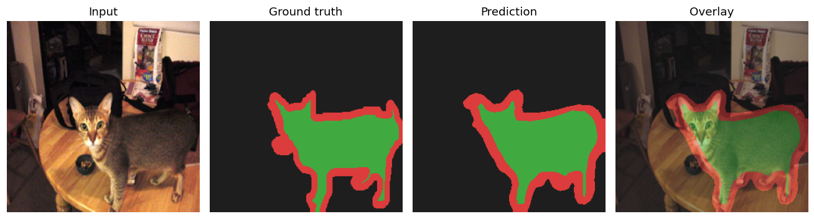
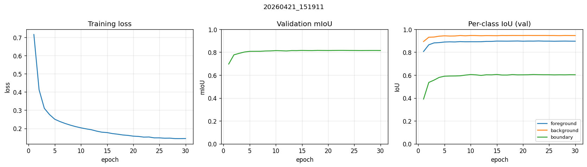

# U-Net Pet Segmentation

Semantic segmentation on Oxford-IIIT Pet with a from-scratch U-Net, a pretrained FCN-ResNet50 baseline for calibration, and the engineering signals a perception reviewer scans for first: augmentation, AMP, cosine-with-warmup, Dice+CE, qualitative grids, training curves, and unit tests — all on a 6 GB GTX 1060 budget.

Dense per-pixel classification is the same computational primitive behind free-space segmentation, semantic occupancy grids, and driveable-surface maps in AV and robot stacks. Oxford-IIIT Pet is a controlled testbed for the encoder–decoder topology that ships in production perception pipelines; the boundary class makes label imbalance explicit, surfacing the same tradeoffs (Dice vs CE, augmentation, pretrained backbones) that appear in every real deployment.

## Results



*Input · Ground truth · Prediction · Overlay — UNet @ 256px with augmentation.*

| Model                  | Params  | Test mIoU | IoU fg  | IoU bg  | IoU boundary | ms / img (1060, fp16) |
| ---------------------- | ------- | --------- | ------- | ------- | ------------ | --------------------- |
| UNet-128 (CE, no aug)  | _TBD_   | _TBD_     | _TBD_   | _TBD_   | _TBD_        | _TBD_                 |
| **UNet-256 (CE+Dice, aug)** | **_TBD_** | **_TBD_** | **_TBD_** | **_TBD_** | **_TBD_** | **_TBD_**         |
| FCN-ResNet50 (fine-tuned) | _TBD_ | _TBD_   | _TBD_   | _TBD_   | _TBD_        | _TBD_                 |

*UNet-128 reproduces the prior 0.7422 baseline from an earlier revision of this repo. UNet-256 isolates the effect of resolution + augmentation + Dice. FCN-ResNet50 anchors the comparison against a pretrained backbone.*



*Train loss, validation mIoU, and per-class IoU across 30 epochs (UNet-256 aug).*

## Architecture

```
Input (3, 256, 256)
    │
    ├── Encoder 1: 3   →  64   ──── skip1 ────┐
    │   MaxPool 256→128                        │
    ├── Encoder 2: 64  → 128   ──── skip2 ───┐ │
    │   MaxPool 128→64                        │ │
    ├── Encoder 3: 128 → 256   ──── skip3 ──┐│ │
    │   MaxPool 64→32                        ││ │
    │                                        ││ │
    ├── Bottleneck: 256 → 512                ││ │
    │                                        ││ │
    ├── Decoder 1: 512 → 256  ← concat skip3┘│ │
    ├── Decoder 2: 256 → 128  ← concat skip2 ┘ │
    ├── Decoder 3: 128 →  64  ← concat skip1 ──┘
    │
    └── 1×1 Conv: 64 → 3
Output (3, 256, 256)
```

Each block is `Conv3×3 → BatchNorm → ReLU → Conv3×3 → BatchNorm → ReLU`. Decoder blocks use `ConvTranspose2d` for upsampling and concatenate the matched encoder skip before the two convs. The 128px config uses the same topology with halved spatial dimensions at every level.

## Dataset

**Oxford-IIIT Pet** — 3,680 train / 3,669 test images with per-pixel masks. 3 classes: `foreground` (pet), `background`, `boundary` (thin ring around the pet, under ~10% of pixels — the imbalanced class that CE alone underweights).

- Train/val split: 90/10 of the `trainval` split, seeded.
- Normalization: ImageNet statistics.
- Augmentation (train only): `RandomResizedCrop(0.7–1.0)`, `HorizontalFlip`, `RandomAffine(±10°, ±5% translate)`, `ColorJitter` — applied jointly to image and mask via torchvision `v2` + `tv_tensors` so geometric ops stay pixel-aligned.

Val and test are never augmented — deterministic eval is non-negotiable.

## Training recipe

| Config             | Size | Epochs | Loss      | LR schedule         | AMP | Aug |
| ------------------ | ---- | ------ | --------- | ------------------- | --- | --- |
| `unet_base`        | 128  | 25     | CE        | StepLR (γ=0.1 @ 10) | off | off |
| `unet_256_aug`     | 256  | 30     | CE + 0.5·Dice | Cosine + 3-ep warmup | on | on  |
| `baseline_fcn`     | 256  | 30     | CE + 0.5·Dice | Cosine + 3-ep warmup | on | on  |

Common: Adam, lr=1e-3 (UNet) / 1e-4 (FCN fine-tune to keep the pretrained backbone stable), batch 16 (UNet) / 8 (FCN), grad-clip 1.0, seed 42. Checkpointing on best val mIoU; last.pth + best.pth per run. Per-epoch metrics stream to TensorBoard *and* `metrics.jsonl` (the JSONL is what `plot_curves.py` parses — no TB event-file scraping).

## Limitations — honest read

- **Oxford-IIIT Pet is easy** relative to outdoor / AV data: clean foregrounds, uniform scale, no occlusion, no motion blur. High mIoU here says little about domain robustness.
- **GTX 1060, 6 GB**: forces batch 8 at 256px for FCN-ResNet50. 384px was considered and rejected — 2.25× step cost, batch ≤ 4, <1 mIoU gain on this dataset.
- **Boundary class** is narrow (~5–10% of pixels); per-class IoU there swings more than the mean — judge by IoU_boundary, not just mIoU.
- **No TTA, no CRF post-processing, no multi-scale eval** — results are raw single-pass argmax on the held-out test split.
- **Reported mIoU is validation-selected**, test-evaluated (best val checkpoint → test); no test-set model selection.
- **Non-determinism is documented, not eliminated**: seeding + `cudnn.deterministic`, but GPU ops retain residual non-determinism. Variance across seeds is not characterized — single-run numbers.

## Reproduce

```bash
# Install (editable, pulls pyproject deps)
make install

# Train the three configs (Oxford-IIIT Pet downloads on first run, ~800 MB)
make train          # UNet-128 baseline (matches prior 0.7422)
make train-aug      # UNet-256 + aug + CE+Dice  (headline config)
make baseline       # FCN-ResNet50 fine-tune

# Multi-GPU (DDP, tested on 2×GPU):
torchrun --nproc_per_node=2 scripts/train.py --config configs/unet_256_aug.yaml

# Evaluate a checkpoint on the test split (per-class + mean IoU)
make eval CHECKPOINT=runs/<ts>/best.pth

# Qualitative grid → artifacts/preds/sample_*.png
make viz CHECKPOINT=runs/<ts>/best.pth

# Training curves → artifacts/curves.png
make curves RUN_DIR=runs/<ts>

# Tests (model shapes, dataset invariants, one-batch overfit smoke test)
make test
```

TensorBoard lives at `runs/<ts>/tb/`; prediction grids are logged every 5 epochs alongside scalars.

## Why this matters for perception work

The topology transfers; the *decisions* are what a reviewer should care about. The ones this repo makes explicit — resolution vs batch-size under a fixed VRAM budget, CE vs Dice on an imbalanced class, pretrained-backbone fine-tune vs from-scratch, AMP for throughput, honest eval without TTA — are the same trade-offs that show up in free-space segmentation, semantic occupancy, and per-pixel confidence maps feeding downstream planners. Pet is the vehicle; the engineering primitives are what generalize.

## Reference

Ronneberger, O., Fischer, P., & Brox, T. — *U-Net: Convolutional Networks for Biomedical Image Segmentation* (2015). [arXiv:1505.04597](https://arxiv.org/abs/1505.04597)
